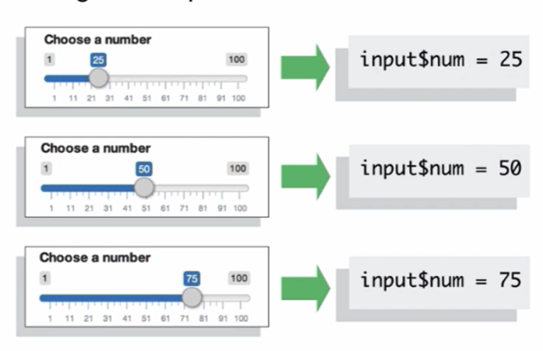
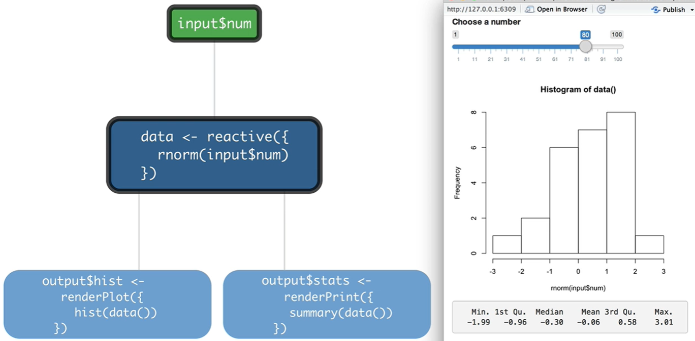
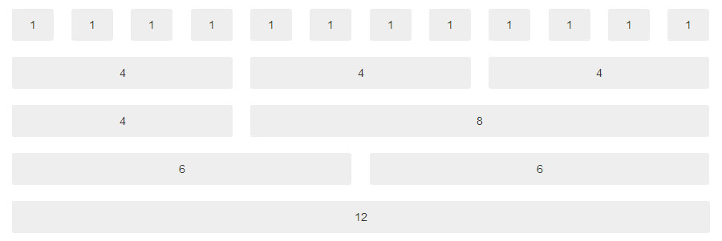
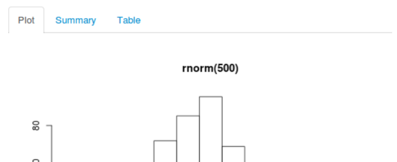
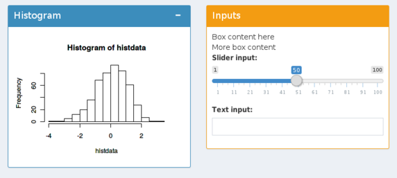

```{r setup, include=FALSE}
library(knitr)
library(shiny)
library(tidyverse)
options(htmltools.dir.version = FALSE)
```


class: middle

## Neste curso vamos aprender

### 1. Como criar um Aplicativo Web com Shiny

### 2. Reatividade (Reactivity)

### 3. Layouts (shinydashboard)

### 4. Disponibilizar no Shinyapps.io


---
class: middle

## Dashboards dinâmicos


.footnote[
fonte: [rstudio.com/shiny/](http://www.rstudio.com/shiny/)
]

---
class: middle, center


### Motivação:

### [Shiny Gallery](https://shiny.rstudio.com/gallery/)

### [Show me Shiny Website](https://www.showmeshiny.com/)

---

## Olá Mundo

```{r, echo=TRUE, eval=FALSE}
library(shiny)

ui <- fluidPage("Hello World!")

server <- function(input, output, session) {
  
}

shinyApp(ui, server)
```

---
class: middle, center

## Ao R!


---

## Inputs e Outputs


```{r, echo = TRUE, eval = FALSE}
ui <- fluidPage(
  # *Input() functions,
  # *Output() functions
)
```


---

## Inputs 


.footnote[
fonte: [rstudio.com/shiny/](http://www.rstudio.com/shiny/)
]


---

## Outputs

```{r, echo = FALSE, eval=TRUE}
tibble::tribble(~Function, ~Output,
                "imageOutput()", "image",
                "plotOutput()", "plot",
                "tableOutput()", "table",
                "textOutput()", "text",
                "verbatimOutput()", "text",
                "htmlOutput()", "raw HTML",
                "dataTableOutput()", "interactive table",
                "uiOutput()", "a Shiny UI element") %>% knitr::kable(format = "html")
```


---

## No exemplo do "hello world" vamos...

1) inserir um slider input que aceita valores entre 1 e 100.

2) Reservar uma área para um gráfico por meio do `plotOutput("hist")`.

3) inserir um textInput() com o parâmetro `inputId = "titulo"`. (exercício!)

---

## Server


```{r, echo = TRUE, eval = FALSE}

server <- function(input, output, session) {
  
  
  
  
  
  
}
```

---

## Server

```{r, echo = TRUE, eval = FALSE}

server <- function(input, output, session) {
  
  output$hist <- renderPlot({
    hist(rnorm(100))    
  })
  
}
```


Lembre-se do nosso UI...

```{r, echo = TRUE, eval = FALSE}
ui <- fluidPage(
  
  ...
  
  plotOutput("hist")
)

```


---

## Server

### render*() functions

.pull-left[

```{r, echo = FALSE, eval=TRUE}
tibble::tribble(~`*output()`, ~`render*()`,
                "imageOutput()", "renderImage()",
                "plotOutput()", "renderPlot()",
                "tableOutput()", "renderTable()",
                "textOutput()", "renderText()",
                "verbatimOutput()", "renderText()",
                "htmlOutput()", "renderUI()",
                "dataTableOutput()", "renderDataTable()",
                "uiOutput()", "renderUI()") %>% knitr::kable(format = "html")
```


]

.pull-right[

```{r, echo = TRUE, eval = FALSE}
# ui
plotOutput("hist")
```

```{r, echo = TRUE, eval = FALSE}
# server
output$hist <- renderPlot({
  hist(rnorm(100))    
})
```


]


---

## Reactive Values e Reactive Functions

Use input values with **`input$`**

.pull-left[



]

.pull-right[


- `render*()` são **reactive functions**

- `input$*` são **reactive values**


]

.footnote[
fonte: [rstudio.com/shiny/](http://www.rstudio.com/shiny/)
]

---

## Reactive Values e Reactive Functions

Se colocarmos **`input$num`** dentro de uma **`renderPlot()`** no nosso exemplo, o output iria **`reagir`** caso o slider fosse mexido pelo usuário.

```{r, echo = TRUE, eval = FALSE}
# server
output$hist <- renderPlot({
  hist(rnorm(input$num))    
})
```


---

## Server

### Recapitulação:

Dentro da função `server`,

1) Guarde o output desejado usando **`output$hist <-`**

2) Alimente o output **`renderALGUMACOISA()`** com códigos

3) Acesse os **input values** com **`input$ALGUMACOISA`**

4) Crie reactividade usando  **`input$*`** dentro das funções **`renderALGUMACOISA()`**

```{r, echo = TRUE, eval = FALSE}
# server
output$hist <- renderPrint({
  hist(rnorm(input$num))    
})
```

---

## Voltando ao nosso exemplo do "hello world"...

3) Vamos fazer o título do histograma de um `textInput("titulo")` + `input$titulo`. (exercício!)

4) Agora crie um **`verbatimTextOutput("sumario")`** na parte do ui;

5) Finalmente, na parte do server, coloque **`summary(rnorm(input$num))`** dentro do **`renderPrint({})`**. (exercício!)

---

class: middle, center, inverse

# Reactivity

---

## Reatividade

Reatividade é a relação entre **reactive values** e **reactive functions**: **reactive values** acionam **reactive functions**


---

## Contextos de reatividade

Reactive values **TEM** que ser usados dentro de um **Contexto de reatividade**.

### Correto

```{r, echo=TRUE, eval= FALSE}
# server
* output$hist <- renderPlot({hist(rnorm(input$num))})
```

### Errado

```{r, echo = TRUE, eval=FALSE}
# server
output$hist <- hist(rnorm(input$num))
```

Códigos dentro do `renderPlot({})`, por exemplo, estarão dentro de um Contexto de Reatividade.

---

## Funções reativas

### Principais reactive functions no Shiny

- **`renderALGUMACOISA({})`**

- **`reactive({})`**

- **`isolate({})`**

- **`observe({})`**

- **`eventReactive({})`**

- **`oberveEvent({})`**

---

## Funções reativas

### **`reactive({})`**

Constrói uma **reactive expression** (se comporta como o **`input$ALGUMACOISA`**!).

```{r, echo = TRUE, eval=FALSE}
# server
data <- reactive({
  rnorm(input$num)
})
```

É usada como uma função qualquer (repare nos parênteses `()` na ponta):

```{r, echo = TRUE, eval=FALSE}
# server
output$summary <- renderPrint({
  summary(data())
})
```

---

## Funções reativas

### **`reactive({})`**



1) Exercício: crie o **reactive expression** data() no  'hello world'.

.footnote[
fonte: [rstudio.com/shiny/](http://www.rstudio.com/shiny/)
]


---

## Funções reativas

### **`isolate({})`**

Desliga a reatividade de um **reactive value**.

```{r, echo = TRUE, eval=FALSE}
# server
output$hist <- renderPlot({
  titulo <- isolate(input$titulo)
  hist(data(), main = titulo)
})
```

Agora **`renderPlot({})`** NÃO vai reagir se **`input$titulo`** mudar.


---

## Funções reativas

### **`observeEvent({})`**

Útil para acionar um bloco de códigos no server toda vez que um **`input$*`** dentro dele mudar.

```{r, echo = TRUE, eval=FALSE}
# ui
actionButton("salvar_dados", "Salve os dados em CSV")
```

```{r, echo = TRUE, eval=FALSE}
# server
observeEvent(input$salvar_dados, {
  write.csv(dados(), "dados.csv")
})
```

PS: `actionButton()` é um tipo de input útil com **`observeEvent()`**. Ver [Using Action Button](https://shiny.rstudio.com/articles/action-buttons.html) da documentação oficial do Shiny.

Exercício: coloque a funcionalidade 'salvar_dados' no 'hello world'.

---

## Funções reativas

### **`observe({})`**

Também útil pra acionar bloco de códigos, mas qualquer **reactive value** dentro dele vai acioná-lo.

```{r, echo = TRUE, eval=FALSE}
# server
observe({
  print(dados())
  print(as.numeric(input$salvar_dados))
})
```

No exemplo, o código será rodado ou se `dados()` mudar ou se `input$salvar_dados` mudar.

---

## Funções reativas

### **`eventReactive({})`**


Cria um **reactive value** que se mudifica quando qualquer **`input$ALGUMACOISA`** dentro dele mudar.

```{r, echo = TRUE, eval=FALSE}
# ui
actionButton("atualizar", "atualizar!")
```

```{r, echo = TRUE, eval=FALSE}
# server
data <- eventReactive(input$atualizar, {
  write.csv(dados(), "dados.csv")
})
```


Exercício: coloque esse reactiveEvent dentro do 'hello world'.


---

class: middle, center, inverse

# Layouts

## [shiny.rstudio.com/layout-guide](https://shiny.rstudio.com/articles/layout-guide.html)

---

## Mas antes... Tags de HTML

```{r, echo = TRUE, eval = FALSE}
fluidPage(
  tags$h1("Meu Primeiro Shiny App"),
  tags$p(
    "",
    tags$a(href = "https://www.rstudio.com/shiny/", "rstudio.com/shiny."),
    tags$strong("Recomendo fortemente que dê uma olhada nele!!")
  )
)
```

```{html}
<div class="container-fluid">
  <h1>Meu Primeiro Shiny App</h1>
  <p>
    O link para o site do Shiny é
    <a href="https://www.rstudio.com/shiny/">rstudio.com/shiny.</a>
    <strong>Recomendo fortemente que dê uma olhada nele!!</strong>
  </p>
</div>
```

---

## Mas antes... Tags de HTML

```{r, echo = TRUE, eval = FALSE}
names(tags)
```
```{r, echo = FALSE}
head(names(tags), 45)
```
...

```{r, echo = TRUE, eval = FALSE}
tags$h1("Meu Primeiro Shiny App")

## <h1>Meu Primeiro Shiny App</h1>
```

---

## Mas antes... Tags de HTML

As tags mais comuns são:

```{r, echo = FALSE, eval=TRUE}
tibble::tribble(~`R function`, ~`HTML`,
                "a()", "um hyperlink",
                "hr()", "linha horizontal",
                "br()", "quebra de linha",
                "code()", "texto com estilo monoespaçado",
                "h1(), ..., h6()", "cabeçalhos",
                "img()", "imagem",
                "p()", "parágrafo",
                "em()", "texto em itálico",
                "strong()", "texto em negrito") %>% knitr::kable(format = "html")
```

---

## Grid System



- Cada linha é um **`fluidRow()`**.
- **`columns`** são divididas em 12 partes iguais. O **`width`** determina quantas partes de largura a coluna vai ter.

.footnote[
fonte: [dzone.com/articles/working-with-bootstrap-4-grid-system-for-creating](https://dzone.com/articles/working-with-bootstrap-4-grid-system-for-creating)
]

--

Grid System vem do [Bootstrap Framework](https://getbootstrap.com.br/docs/4.1/getting-started/introduction/) do Twitter.

---

## Grid System

Duas principais funções de layout

```{r, echo=TRUE, eval = FALSE}
fluidRow()
```
```{r, echo=FALSE, eval = TRUE}
cat(as.character(fluidRow()))
```

```{r, echo=TRUE, eval = FALSE}
column(2)
```
```{r, echo=FALSE, eval = TRUE}
cat(as.character(column(2)))
```

---

## tabPanels e tabsetPanels

```{r, echo = TRUE,eval=FALSE}
# ui
tabsetPanel(
  tabPanel("Gráfico", plotOutput("grafico")), 
  tabPanel("Sumário", verbatimTextOutput("sumario")), 
  tabPanel("Tabela", tableOutput("tabela"))
)
```



---

## pageWithSidebar Layout

```{r, echo = TRUE, eval = FALSE}
pageWithSidebar(
  headerPanel = headerPanel("Olá Shiny!"),
  
  sidebarPanel(
    sliderInput("n", "Tamanho da amostra:", min= 0, max=150, value=50)
  ),
  
  mainPanel(
    plotOutput("grafico_do_iris")
  )
)
```


---

## navbarPage Layout


```{r, echo=TRUE,eval=FALSE}
navbarPage(title = "Meu Site Navbar",
           tabPanel("a"),
           tabPanel("b"),
           tabPanel("c"),
           tabPanel("d")
)
```

output:


---

## shinydashboard Layout


.footnote[
fonte: [db.rstudio.com/dashboards/](https://db.rstudio.com/best-practices/dashboards/)
]
---

## shinydashboard Layout

### O template

.pull-left[

```{r, echo = TRUE,eval=FALSE}
ui <- dashboardPage(
  dashboardHeader(),
  dashboardSidebar(),
  dashboardBody()
)

#server...
```

]

.pull-right[


]

---

## shinydashboard Layout

.pull-left[

### box 

```{r, eval=FALSE}
box(
  title = "Histograma", ...
),
box(
  title = "Inputs", ...
)
```



]

.pull-right[

### tabBox 

```{r, eval=FALSE}
tabBox(
  title = "Densidades",
  tabPanel("Sepal.Length",..),
  tabPanel("Sepal.Width",...),
  tabPanel("Petal.Length",..),
  tabPanel("Petal.Width",...)
)
```


]

---

## shinydashboard Layout


.pull-left[

### valueBox


**`renderValueBox({}) + valueBoxOutput()`**

]

.pull-right[


### infoBox


**`renderInfoBox({}) + infoBoxOutput()`**

]


---

## shinydashboard Layout

### dashboardHeader 


```{r, echo = TRUE,eval=FALSE}
dashboardPage(
* dashboardHeader(title = "Iris Predictor"),
  
  dashboardSidebar(...),
  dashboardBody(...)
)

#server...
```


---

## shinydashboard Layout

#### dashboardSidebar + sidebarMenu + menuItem 

```{r, eval=FALSE}
dashboardSidebar(
    sidebarMenu(
      menuItem("Calculator", tabName = "calc"),
      menuItem("Descriptive", tabName = "desc")
    )
  )
```

#### dashboardBody + tabItems + tabItem

```{r, eval=FALSE}
dashboardBody(
    tabItems(
      tabItem(tabName = "calc",...),
      tabItem(tabName = "desc",...)
    )
)
```

---

## Exercício 1 (dificuldade média)

Reproduza a aba "Calculator" [desse dashboard (clique aqui!)](https://rseis.shinyapps.io/asnv-shiny/).


---

## Exercício 2 (difícil!)

Reproduza a aba "Descriptive" [deste dashboard (clique  aqui!)](https://rseis.shinyapps.io/asnv-shiny/).


---

class: middle, center, inverse

# Shinyapps.io

---
class: middle, center

## Shinyapps.io

### Ao R!


---

## Referência

Este curso é baseado no [Garrett Grolemund's Shiny Tutorial](https://shiny.rstudio.com/tutorial/).
